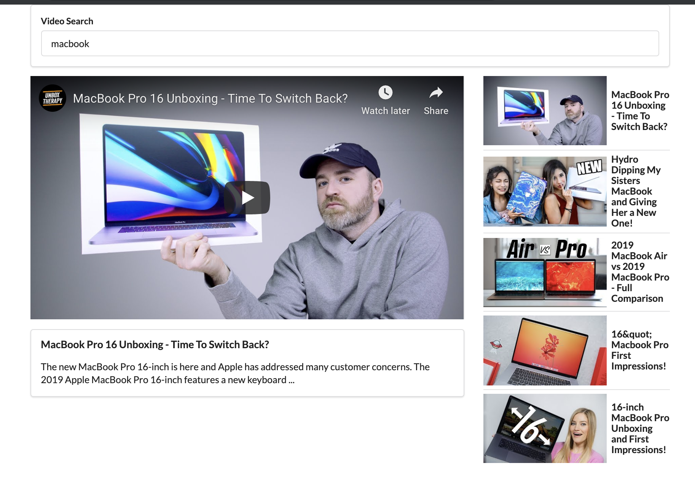

# youTuSearch

- https://novemberfall.github.io/youTube/

---
- a search page for youtube videos by using react.js
- using `gh-pages`
---

## import youtube API from google developer

## functionality:
- input keyword, for example:

---

- click `play` button:

- click `pause` button:

- everytime, show total 5 videos depends on youTube API

